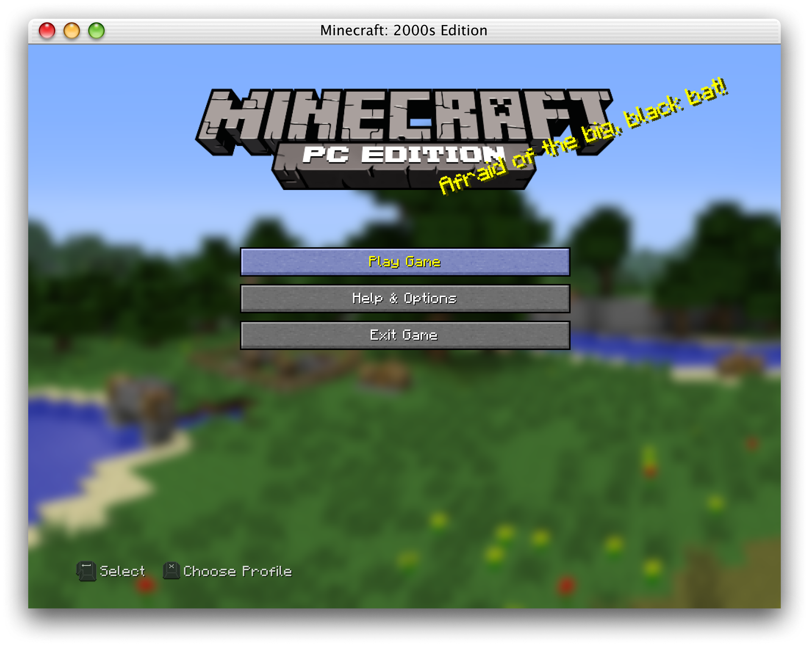
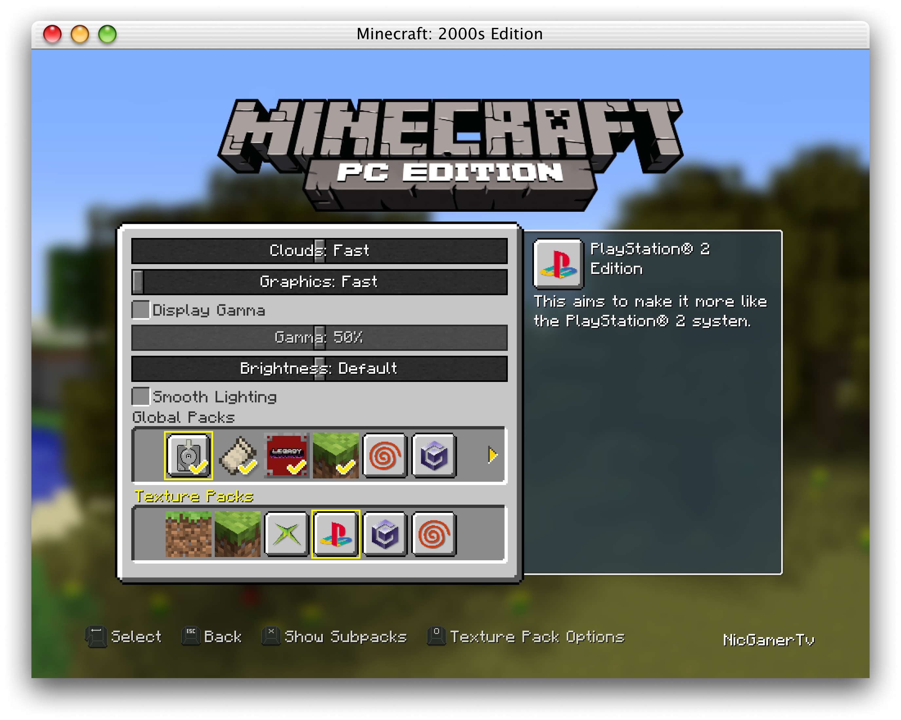

# 2000s Edition

2000s Edition is a Legacy4J modpack aiming to recreate Title Update 9, but with an added twist of being a "what-if" experience, envisioning if it had released in the early 2000s. It's aims to deliver graphics similar to other games in the 6th Generation of 
onsoles.
## Resource Albums

Various Resource Albums have been added to add to the feel of using various different 6th Gen consoles, such as the original Xbox, PlayStation® 2, Nintendo GameCube, and Sega Dreamcast.

