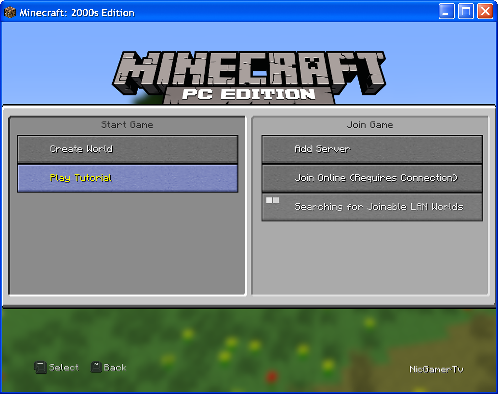
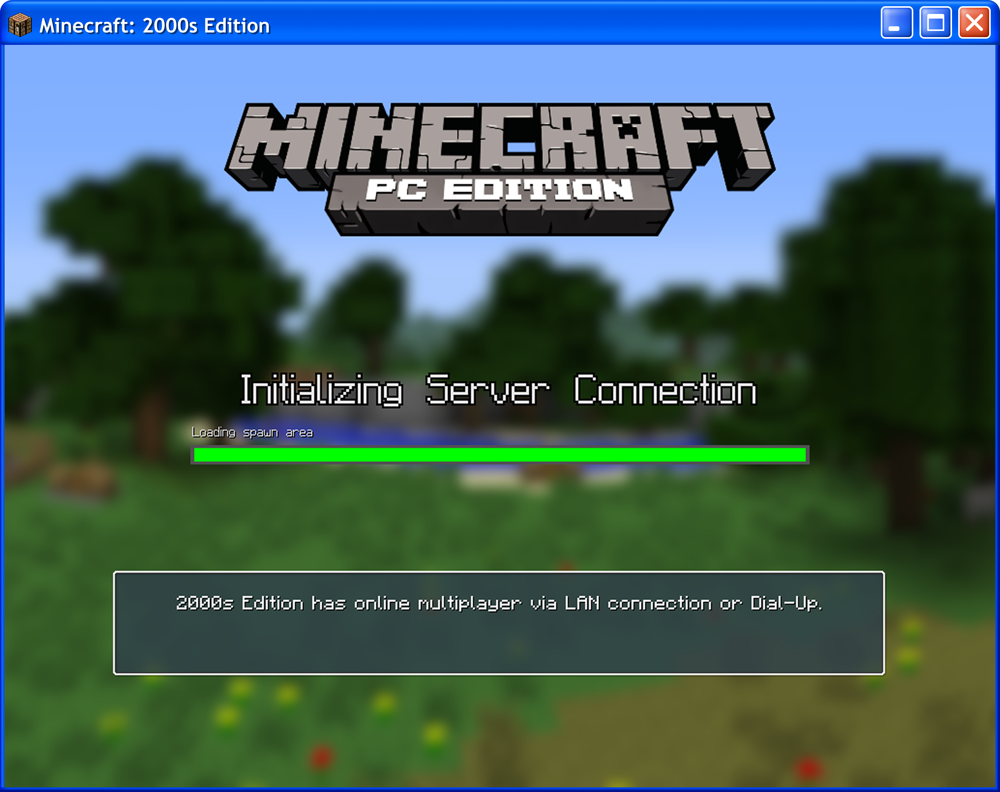
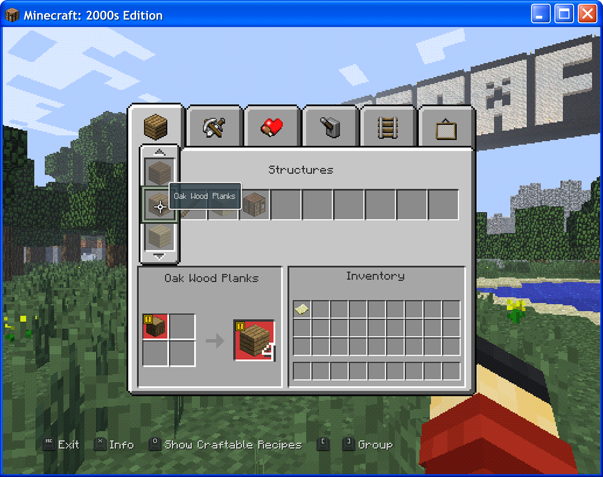
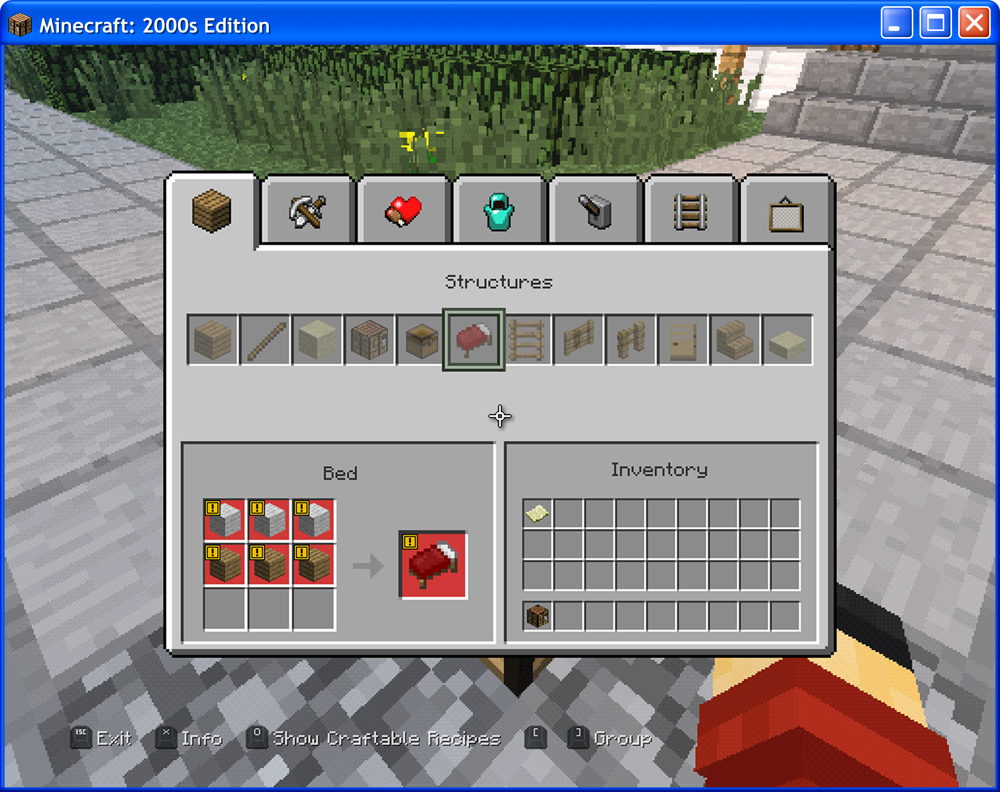
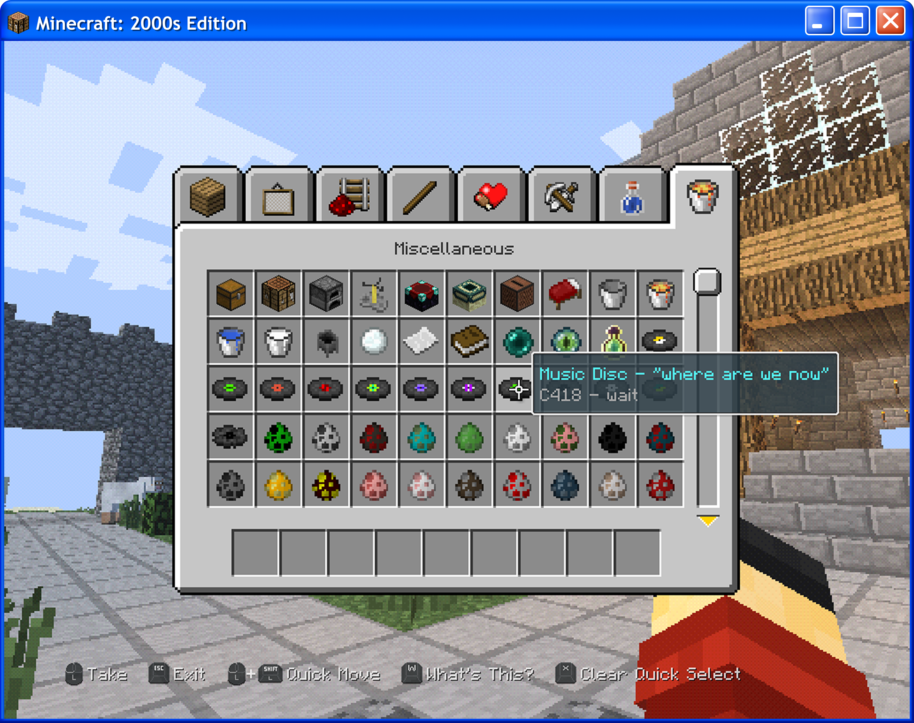

# TU9 Accuracy
With 2000s Edition, it aims to recreate TU9 as close as possible.
## User Interface
The user interface aims to be like TU9 but some User Interfaces can't be changed such as the Inventory Screen. 

  
  

## Crafting Recipes
The crafting recipes aims to be close to the ones from TU9.  

  
  

## Accurate Names and Tips
Some of the items are changed to be more like TU9 such as the music discs like "Music Disc - where are we now". 

  