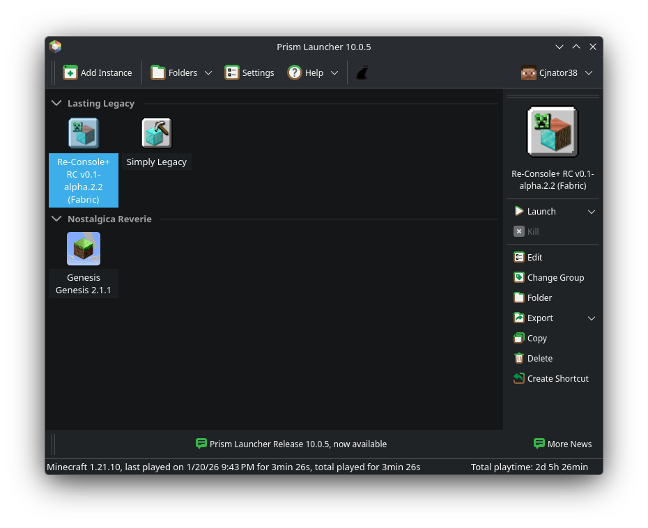
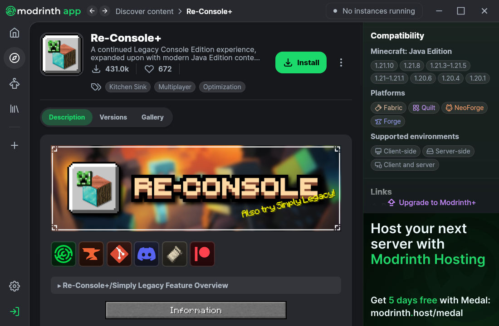
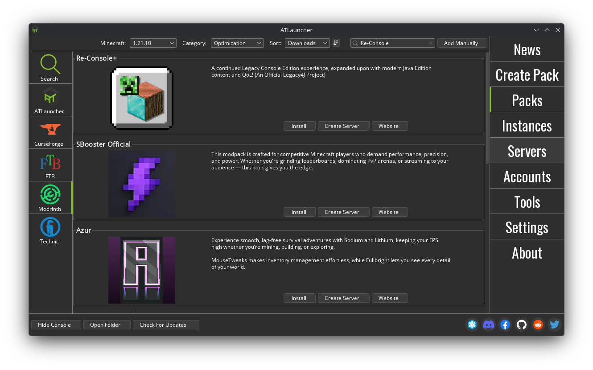

# Installation
There are various different ways you can install our modpacks and jump right in.

::: info
We recommend installing our modpacks from Modrinth, as these versions are the most feature-complete as of writing.
:::

## Recommended
### [Prism Launcher](https://prismlauncher.org)
If you'd like to have more granular control over your setup, we recommend using Prism Launcher. It offers powerful, in-depth instance and content management, with support for both Modrinth and CurseForge.   It is also the best option for those using Steam Gaming Mode (like on Steam Deck or a Linux distro such as Bazzite), as it provides an easy route to add your instance to Steam.

### [Modrinth App](https://modrinth.com/app)
For the quickest and easiest installation, we recommend using the Modrinth App. It offers direct access to Modrinth services, allowing you to follow projects and update content directly from the app. It does not, however, have access to CurseForge services, meaning you'll have to download CF content off the internet manually.

To install, simply head to "Discover content" and search in the "Modpacks" tab.

### [ATLauncher](https://atlauncher.com/)

ATLauncher provides a similar feature set to Prism Launcher, and can be setup relatively easily. Just open the "Packs" tab, navigate to "Modrinth" and search for the pack you'd like to play.

## Launchers with known issues
### CurseForge App
The CurseForge App is not as stable as the options above due to complications with its ownership, the fact that it isn't entirely dedicated to being a Minecraft Launcher, and lack of optimization compared to other launchers.

### Official Minecraft Launcher
The official Minecraft Launcher does not natively support modded instances, and therefore should not be used to install our modpacks.

### Cracked Launchers
We will not provide support for those who use launchers that enable piracy by giving access to Minecraft: Java Edition for free. These launchers can be plagued with issues that can negatively impact gameplay. If you ask for support using these launchers, please purchase the game and use a recommended launcher.   Otherwise, we will have reason to ban you from our community for promoting software piracy.
