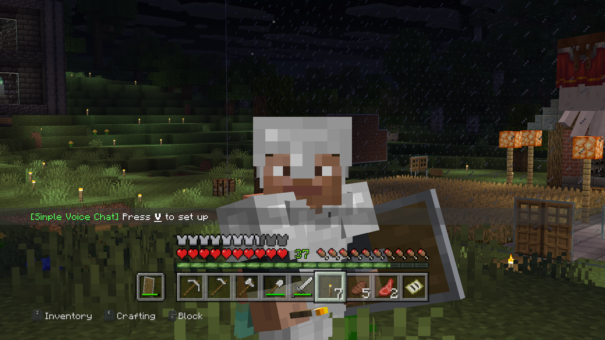
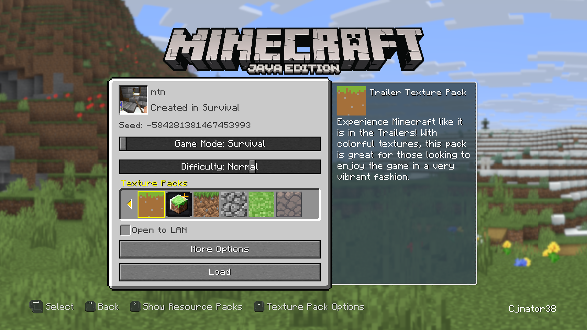
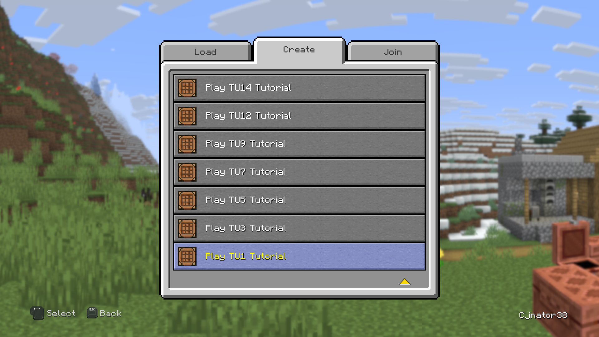
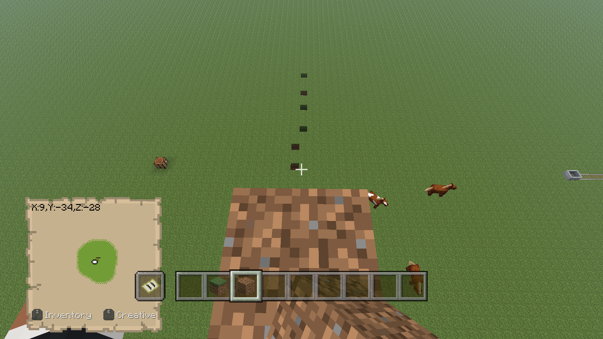
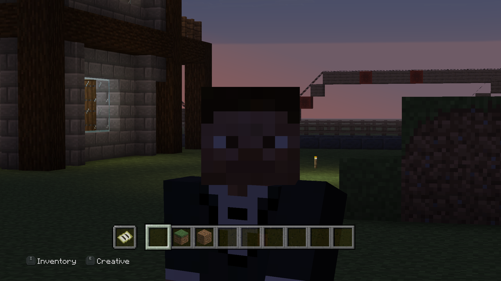
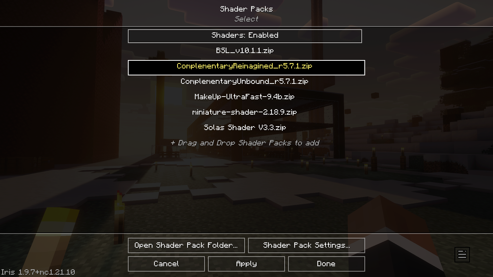
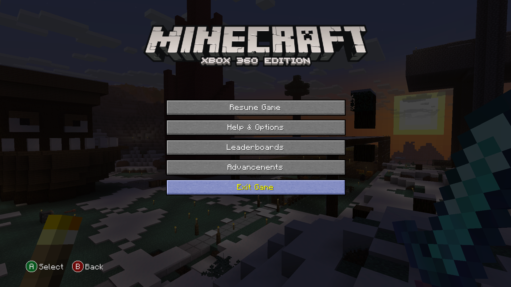
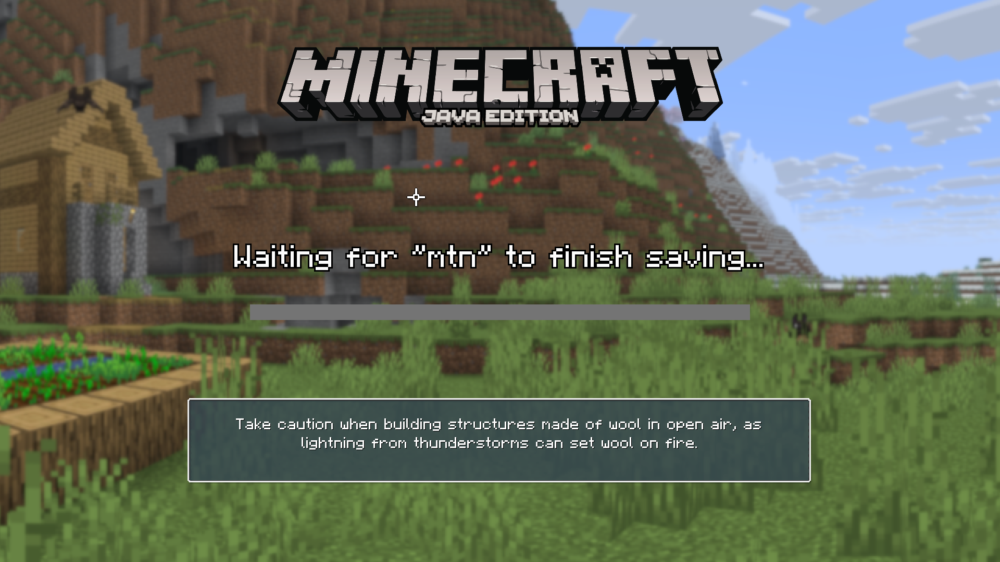
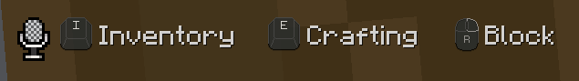
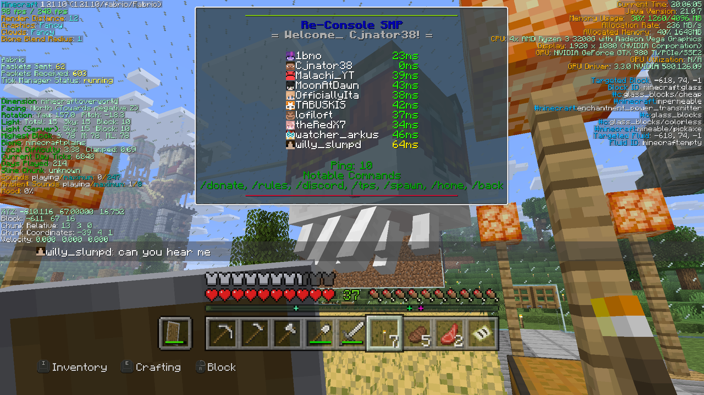

# Re-Console+

Re-Console+ is a Legacy4J modpack aiming to expand upon the original Legacy Console Edition experience with common modded enhancements, such as zooming, connected texture, dynamic lighting and better grass textures.   There are also additional bundled texture packs, shader support with bundled shaders, integrated voice chat, and much more!  
For information on the original multi-version Re-Console, see [Re-Console LTS](./rc-long-term-support)

### Features
A lot of the feature set of Re-Console+ is derived from Simply Legacy, which provides a much closer experience to LCE. You can view its feature set [here](../simply-legacy/overview#features).

In addition, there's also:
- Additional Texture Packs
::: details

:::
- All Tutorial World Versions
::: details

:::
- Bedrock-Style Block Placing/Bridging
::: details

:::
- Additional OptiFine Features
  - Connected Textures
  - Better Grass
  - Dynamic Lighting
  - Zoom
::: details

:::
- Shader Support with bundled shaders
::: details

:::
- C2ME and FastQuit
::: warning
These mods prevent the Manual Save Cache from being enabled. If you do enable it, you're at risk of corrupting your world.
:::
::: details

:::
- Idle Enhancements
  - Dynamic FPS (battery display, FPS limit when unfocused)
  - Idle Tweaks (reduces render distance when unfocused)
::: warning
The above mods disallow gameplay when the game is unfocused
:::
- Simple Voice Chat
::: details

:::
- Various HUD Mods
  - BetterF3
  - Ping View
::: details

