# Simply Legacy
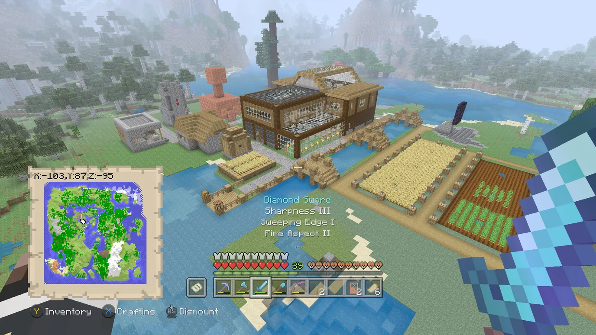

Simply Legacy is a Legacy4J modpack aiming to recreate Legacy Console Edition in a manner that is faithful to both the latest versions of LCE and the vanilla Java Edition.

### Features
Much of these features are used as the basis for the experience seen in Re-Console+, which itself provides a whole lot of quality-of-life features. You can see its feature set [here](../re-console/overview#features).

- All the features of Legacy4J, including Save Cache (manual saving support)
::: details Screenshot
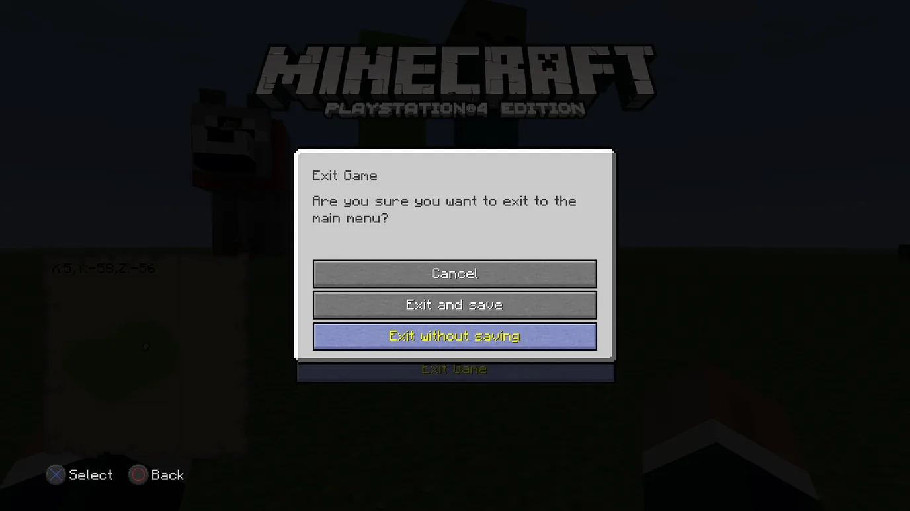
:::
- All LCE Mash-up Worlds
::: details Screenshot
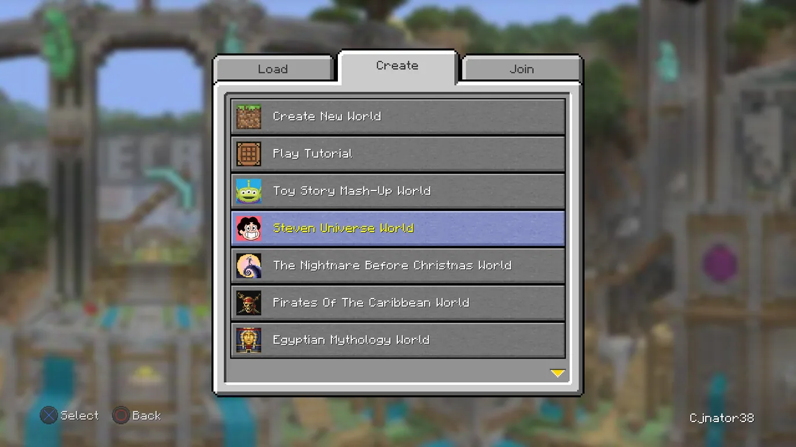
:::
- Most of the LCE Texture Packs (not all due to DMCA complications)
::: details Screenshot
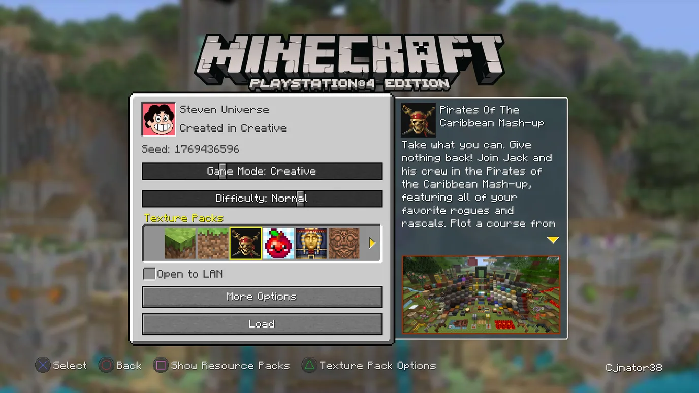
:::
- LCE Skin Packs
::: details Screenshot
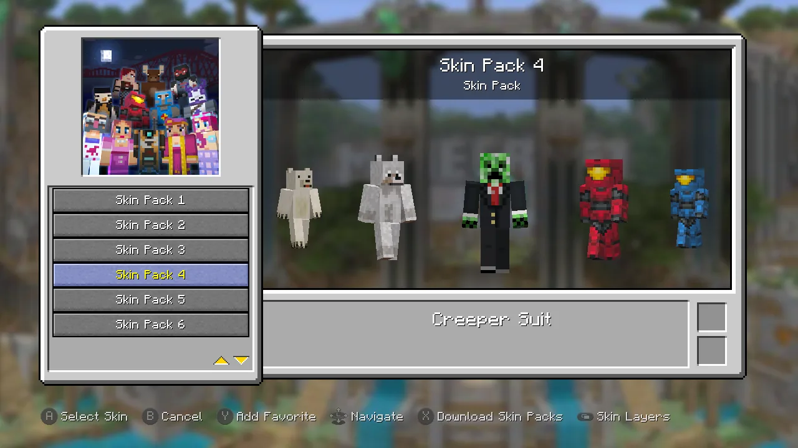
:::
- Programmer Art Continuation Project (by mzov_jen) installed by default
::: details Screenshot
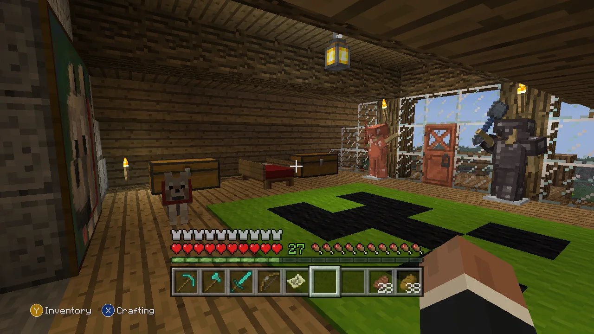
:::
- Entity Model Features and Entity Texture Features
::: details Screenshot
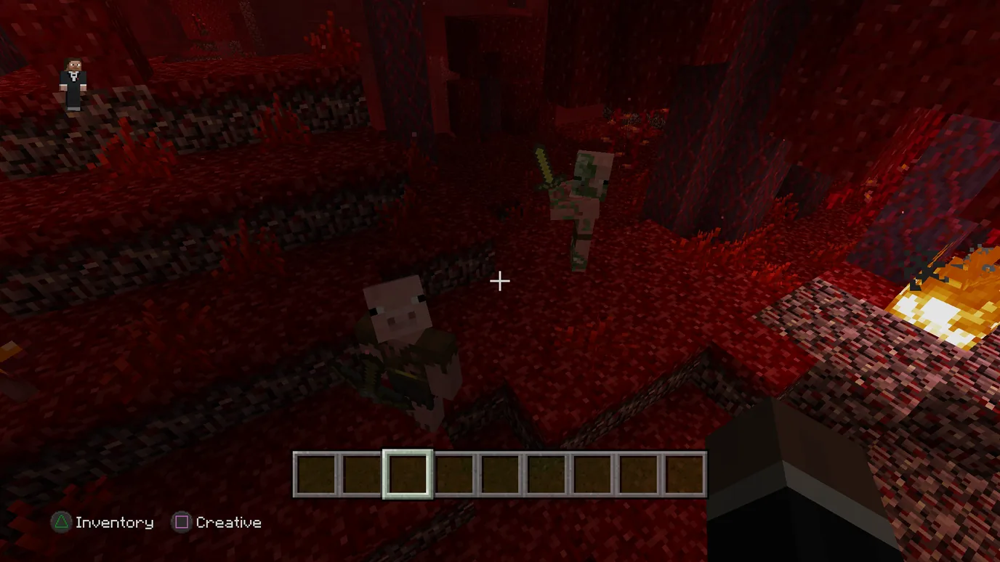
:::
- LCE or LCE-style Mini Games: Glide and Fistfight currently
::: details Screenshot
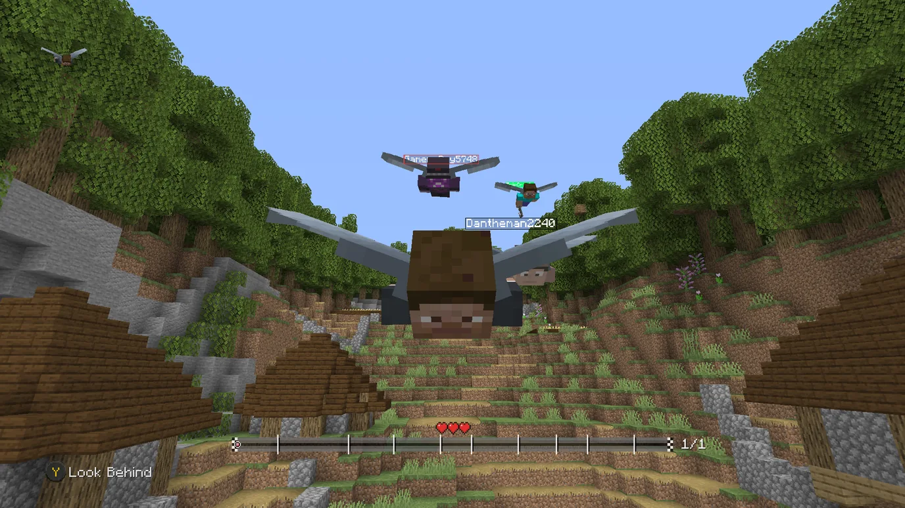
:::
- Custom Achievements and Various Sounds
::: details Video
<video controls="controls" src="./images/achievements-sounds.mp4"/>
:::
- Limited World Sizes and Biome Scale
::: details Screenshots
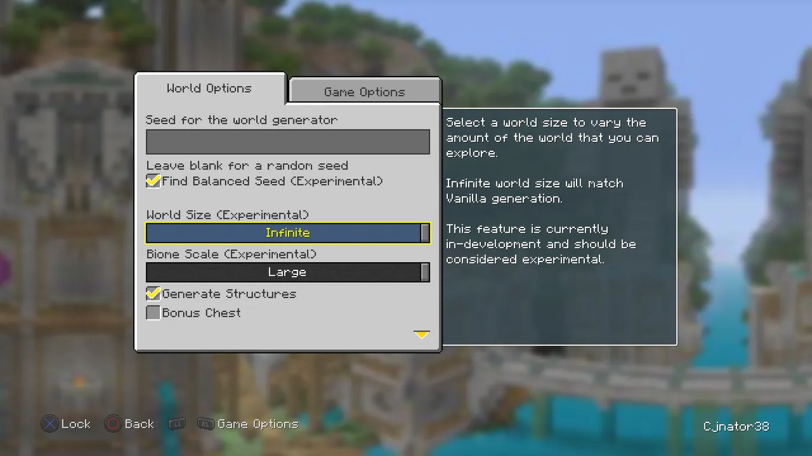
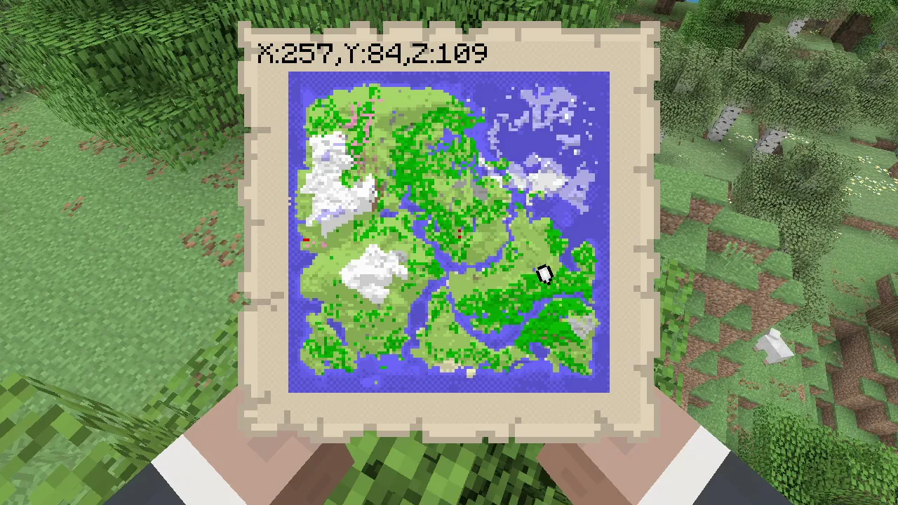
:::
- [Custom Legacy4J Options Presets](/modpacks/option-presets)
  - Render Distance maxes out at 64 chunks
  - Easily enable/disable the Fake Autosave Screen
::: details Screenshots
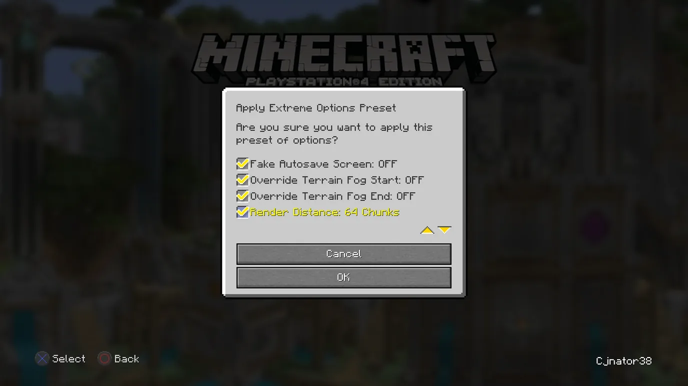
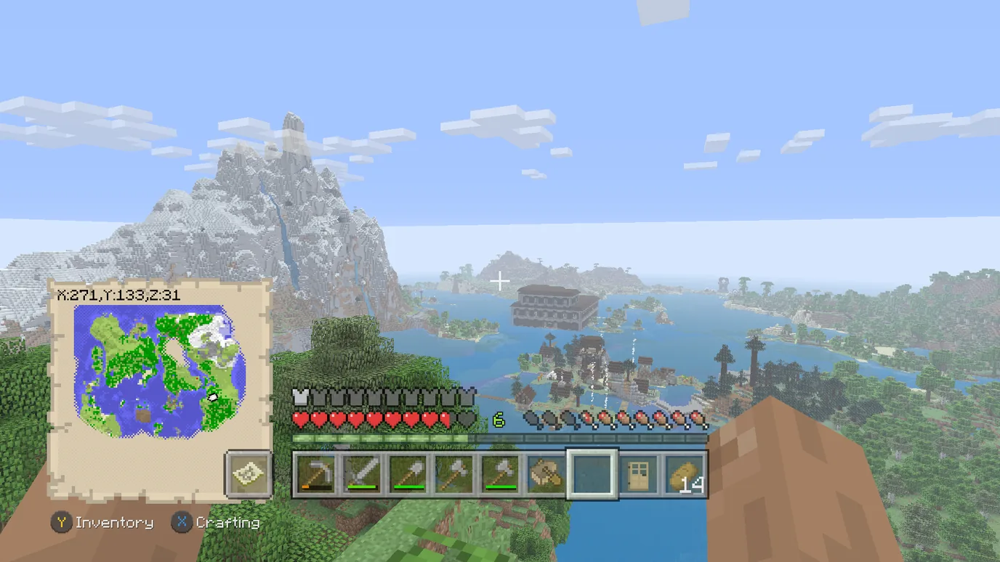
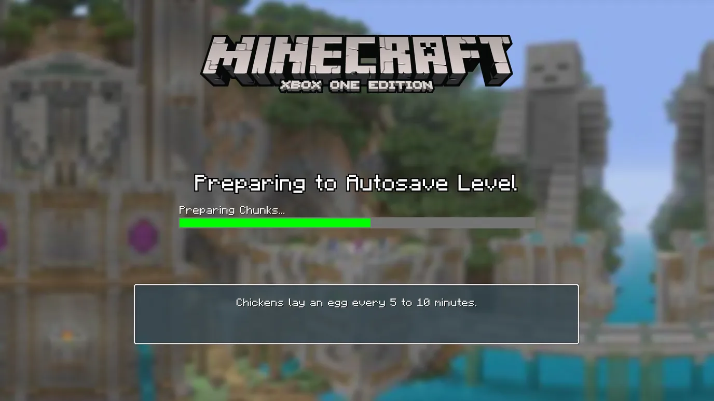
:::
- Custom Minecraft Logos
::: details Screenshot
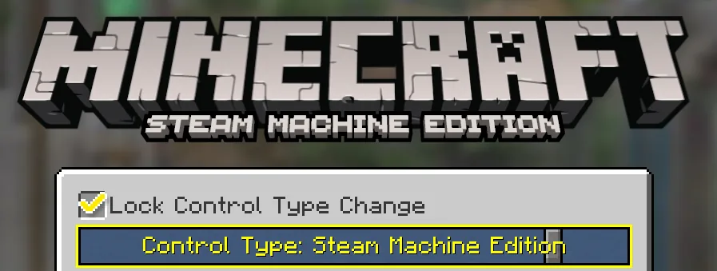
:::
- Borderless Fullscreen
  - Enables use of `Force Active Window` so you can play without having the game window focused
