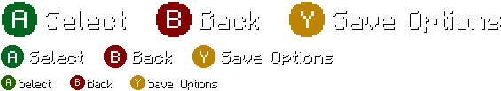

# Controls
While Legacy4J can still play in a similar manner to vanilla Java Edition, there are differences that may affect or enhance gameplay.

## Control Icons
Also commonly known as _controller tooltips_, these are the icons are used to surface available actions in the current context.

 The icons you could see in a Crafting Table when using a Keyboard and Mouse 

### Changing the Appearance
- You can change what control icon set and even what Minecraft title is used by changing the `Control Type` option

<video controls="controls" src="./control-type.mp4"/>
Changing the Control Type with the Legacy Titles resource pack

- The icons will also change appearance based on the set `UI Mode`

 Xbox 360 Edition icons at Full HD (1080p), HD (720p) and SD (480p) modes, respectively

**Lock Control Type Change**  
By default, when switching between keyboard and gamepad input, the icons will switch between `Java Edition` and the set `Control Type` to reflect the current input.  

With this option enabled, the selected `Control Type` will persist even when using a keyboard/mouse for input:

<video controls="controls" src="./lock_control_type_change.mp4"/>

- The `Auto Control Type` will apply the type corresponding to the detected controller, or `Java Edition` if using just a keyboard

<video controls="controls" src="./auto_control_type.mp4"/>

For information on modifying `Control Icons` and the Minecraft title using a resource pack, see [Custom Control Types](./custom-control-types)

## Cursor Mode
This option controls how the mouse cursor should be shown
- `Auto` shows the cursor when mouse movement is detected, and hides when navigating with the keyboard or gamepad
- `Always` will show the cursor regardless of input
- `Never` will hide the cursor in any user interface where it isn't used by a controller (i.e. the cursor will still show in the Inventory, but not in Crafting)

## Key Binds
Keyboard and Mouse input acts mostly the same as it would on normal Java Edition, but with slight differences.

Here's a few pro tips:
- In some menus (like Options menus), `X` and `O` are used in place of what `X` and `Y` would be on an Xbox gamepad, for example
- Inventory management is split between the Survival Inventory and the Creative Inventory/Crafting Interface. In Legacy4J, the keybinds for these are `I` and `E` by default, respectively

## Controller Support

Legacy4J has built-in controller support, powered by isXander's fork of libsdl4j, same as [Controlify](https://github.com/isXander/controlify).

### Inventory Management

- By default, double click functionality is disabled, like in older versions of Java Edition. This, ironically, can actually make inventory management faster, since some Quick Move actions can overlap and cause unintended inputs.
- Distributing items with a controller is done by toggling with the Left Trigger, like on LCE
- Bundles can be navigated by pushing the Right Stick up and down.

### Linear Camera Movement
Legacy Console Edition used an exponential response curve for camera movement, allowing more precise movement when closer to the stick's center, but slows movement on the diagonals. A linear response curve (like what Bedrock Edition uses) can fix this, sacrificing this precision.

### Force Active Window

This can be enabled in `Game Options` to allow controllers to send input to the game without the Minecraft window being focused.

### Virtual Cursor

The `Virtual Cursor` is used in order for the controller to have cursor input independently of the system's mouse cursor input. This is especially useful when using multiple instances with multiple controllers, or using a controller to play on a second monitor while interacting with content on the primary monitor.

**Inventory Bounds**

With `Virtual Cursor` enabled, `Limit Cursor to Inventory Bounds` is self-explanatory: the cursor will be limited to the bounds of the container interface.
