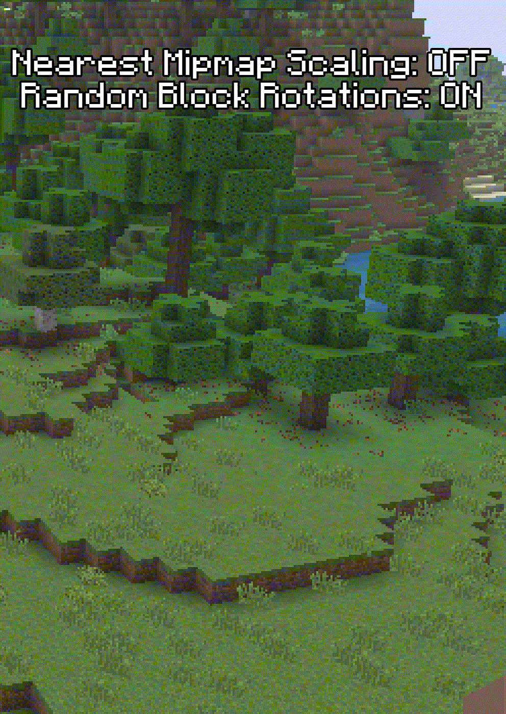
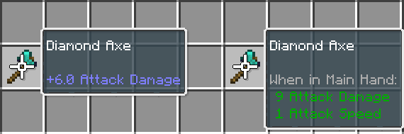

# Gameplay/Visual Features
Legacy4J introduces several fundamental gameplay and in-game visual changes to match the experience provided by the Legacy Console Edition.

## Legacy Crafting and Creative Menus
The Crafting System and Creative Inventory as of the latest versions of LCE has been fully implemented.  
By default, this is limited to the tabs used in LCE, but can be extended (without a resource pack) using:
- `Operator Items Tab` - Same as vanilla, adds a tab with operator items such as the Command Block, Light blocks and Barrier blocks.
- `Mod Crafting Tabs` - Adds tabs with recipes provided by external mods
- `Display Vanilla Tabs` - Adds tabs from the vanilla Recipe Book or Creative Inventory
- `Search Creative Tab` - Adds a search tab to the Creative Inventory

 To navigate between these, use `Shift`+`Left Arrow`/`Right Arrow` or the Right Stick on your gamepad. 

To extend these menus further using resource packs, refer to [Listing-Based Manager](./listing-based-manager)

## Resource Albums
Resource pack profiles that can function similarly to the LCE Texture Packs.  
For more information, see [Resource Pack Management](./resource-pack-management)

## Host Options
If you are the host of a world, regardless of whether of not `Host Privileges` is available, you will have access to `Host Options`.
- This is available by pressing the `H` key by default, or `Back` on gamepad, then pressing `Host Options`
- This gives you access to various gamerules, [common options](#legacy4j-common-options) and various mixins
- If `Host Privileges` is enabled, you will also have access to more gamerules, as well as time and weather control.

## LCE-style Mipmaps and Block Rotations
Using [FactoryAPI](/mods/factoryapi/overview#player-features), the distant textures are scaled with Nearest Neighbor scaling, and random block rotations can be toggled.  
These options combine to give the game a bit of that iconic look!

By default, [Random Block Rotations](/mods/legacy4j/configuration#random-block-rotations-factoryapi) is disabled, and [Nearest Mipmap Scaling](/mods/legacy4j/configuration#nearest-mipmap-scaling-factoryapi) is enabled.   You can find these under [`Advanced Graphics`](/mods/legacy4j/configuration#advanced-graphics) options, and can also be found in the FactoryAPI mod options.
::: details Comparison

:::
 
 
 

# Legacy4J Options
Options applied through the `config/legacy/client_options.json`, available in `Advanced Game Options`
## Save Cache
Save Cache is used to add the manual saving functionality seen in Xbox One and PlayStation 4 Editions of LCE.  
This means that autosaving can be toggled off in the Pause Menu, or by setting the Autosave Interval to OFF.  
Unless `Fake Autosave Screen` (`Advanced User Interface`) is enabled, this is done without interruption, like in vanilla Java Edition.

This can be disabled by:
- Toggling the `Save Cache` option in `Advanced Game Options`
- Joining a multiplayer server
- Playing a world created in Hardcore Mode

### Save Cache - Troubleshooting
If you have `Save Cache` enabled and a world in your `saves` directory looks corrupted, check the `currentWorld` folder in case a copy of the world is still there. If so, copy it back to the `saves` directory.

## Legacy Creative Block Placing
Creative block placement from LCE has been implemented. This allows block placement to match your flight speed.
 
 
 

# Legacy4J Common Options
Options applied through the `config/legacy/common.json`, available in `Advanced Game Options`, or `Host Options` when in-game
## Legacy Combat
Legacy Combat enables the combat system used prior to Java Edition's Combat Update, and currently used on Bedrock Edition.  
- This changes how many of the attributes are displayed to visually match LCE:

- Damage values have been reduced to match either LCE or Bedrock
- Sweep attacks are still available, but requires any level of the Sweeping Edge enchantment
This is controlled by the `legacyCombat` common option, 

## Legacy Sword Blocking
Legacy Sword Blocking enables the sword blocking mechanic available prior to Java Edition's Combat Update.
- This can be toggled separately from Legacy Combat, meaning you can have sword blocking with modern combat
- Like other item actions, the off-hand has priority, so using a shield, for example, is still possible if held in the off-hand

## Squared View Distance
Squared View Distance allows chunks on the edge of Render Distance to render in a square shape, rather than a circle.
 
 
 

# Gamerules
These gamerules can be toggled and adjusted in `Existing World/Create New World > More Options > Game Options` or in `Host Options`
## Legacy Flight
The Creative flight from LCE has been fully implemented.
- Flying no longer maintains momentum, so you can stop much faster
- Sprint flight is much faster than in vanilla
- Non-sprint flight is 8-directional, making alignment during building much easier
- Slow flying is 4-directional
This is controlled by the `legacyFlight` gamerule.

## Legacy Swimming
Swimming from Update Aquatic and newer versions of LCE have been implemented.
- Swimming can be invoked when looking below the horizon line
- Swimming can be invoked in water of any height
- Swimming up with the Jump button is faster
- There is a barrier at the water's surface that keeps the player swimming, rather than having the player stop swimming when at the surface
- Friction at the water's surface is lessened
This is controlled by the `legacySwimming` gamerule.

## TNT Limit
The `tntLimit` gamerule can be used to limit the amount of Primed TNT entites that can exist in a world.  
This is controlled with an integer value, and defaults to `20`

## Starter Map
`starterMap` controls whether or not new players will spawn with an Empty Map.  
This is controlled by a boolean, and defaults to `true`

## Starter Bundle
`starterBundle` controls whether or not new players will spawn with a Bundle item.  
This is controlled by a boolean, and defaults to `false`
