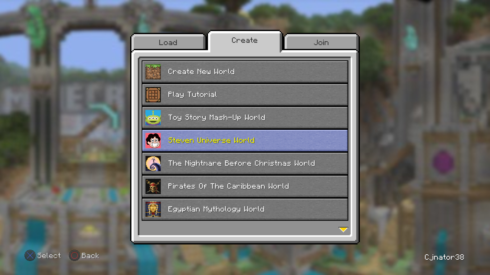

# World Templates
World Templates are the entries seen in the Create tab on the Play Game screen. These are defined through `namespace:world_templates.json` in a resource pack.


<sub>World Templates provided by the Legacy Worlds resource pack</sub>

## Components
```json
[
  {
    "buttonMessage": {"text": "My Cool World!"},
    "icon": "cool_world:icon",
    "templateLocation": "world_templates/cool_world.mcsave",
    "isGamePath": true,
    "folderName": "My Cool World!",
    "downloadURI": "https://host-my-world.net/cool-guy/cool-world/cool-world.mcsave",
    "preDownload": false,
    "directJoin": false,
    "isLocked": false,
    "resourceAlbum": "cool_texture_pack"
  }
]
```
Components which can be defined by a World Template include:
- Display name ([`buttonMessage`](#buttonMessage))
- Icon ([`icon`](#icon))
- Location of the template's save file ([`templateLocation`](#templateLocation))
- Whether said location is a game path ([`isGamePath`](#isGamePath))
- The world's folder name ([`folderName`](#folderName))
- A remote download URI ([`buttonMessage`](#downloadURI))
- If the world should be downloaded on resource load ([`preDownload`](#preDownload))
- If the Load Save screen should be skipped ([`directJoin`](#directJoin))
- If Resource Albums should be locked ([`isLocked`](#isLocked))
- A defined Resource Album ([`resourceAlbum`](#resourceAlbum))

### `buttonMessage`
A title can be given to a template using `buttonMessage`, which accepts any type of [text component](https://mc.wiki/Text_component_format#Java_Edition) (typically a text string with `text` or a translation key with `translate`).

### `icon`
An icon can be given to a template using `icon`. This field will reference a sprite located within `namespace:textures/gui/sprites`

### `templateLocation`
The save file that would be used for the World Template can be referenced using `templateLocation`. This would typically be stored in a `.zip` or `.mcsave` file, both of which are interchangeable file formats (as in, you can change the file extension and it would function the exact same)

### `isGamePath`
Determining whether or not `templateLocation` is a game path can be done with `isGamePath`. This is done with a boolean:
- `true` if the path is located under the `.minecraft` folder
- `false` if the path is a [resource location](https://mc.wiki/Resource_location)

### `folderName`
The name of the world's folder when saved to the `saves` folder is defined using `folderName`. This can simply be a plaintext string.

### `downloadURI`
A remove download URI can be defined using `downloadURI`. This would simply be a link to a remote location where your save file is hosted.

### `preDownload`
Whether or not a World Template save is downloaded on resource load can be controlled with `preDownload`, set with a boolean.

### `directJoin`
Whether or not a World Template skips the Load Save screen (similarly to the Tutorial World) can be defined with `directJoin`, set with a boolean.

### `isLocked`
Whether or not the Resource Album widget in the Load Save screen is locked when creating a world from a World Template can be defined with `isLocked`, set with a boolean.

### `resourceAlbum`
The Resource Album that the World Template should be set to can be defined with `resourceAlbum`. This is done with the Resource Album's defined `id` (found within the `resource_album/album.json`)
