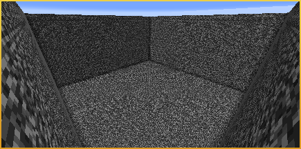
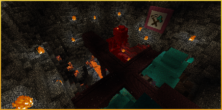
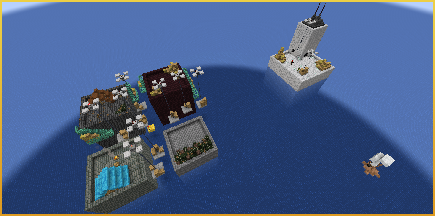
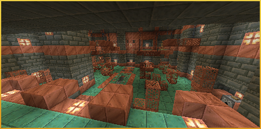
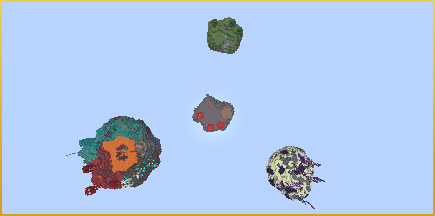
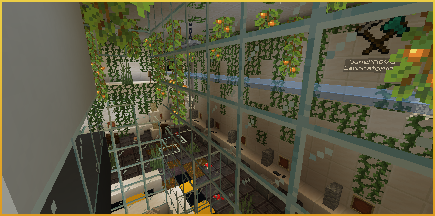
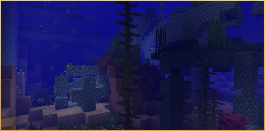

# Fistfight Mini Game
## Maps:
| Image | Map Name | Description |
| ------------- | :-----------: | ----: |
| {width=200} | Bedrock Box | The original Fistfight map made by Jab125. |
| {width=200} | Crimson Fortress | Map made by Ahsumcrafter and NicSonic. |
| {width=200} | Skylines | Once a thriving city, but now it lies in ruins beneath the water. Map by TripIsParanoid. |
| {width=200} | Trial Chamber | Explore and Battle it out in a vertically focused map set in a reimagined Trial Chamber. Map by JacksTheGreat and NicSonic. |
| {width=200} | Skywars | Map made by Jab125. |
| {width=200} | Supernova Laboratory | Roam around the abandoned basement of the coolest inspirational laboratory of Portal 2! Map by NicSonic and Ahsumcrafter. |
| {width=200} | Undersea Oasis | Fight around the waters through an abandoned prismarine bridge while trying to survive in the water.\nMap by Jab125 and NicSonic. |