# Glide Mini Game
Glide is a mini game from Legacy Console Edition where you fly through various different maps with Elytra to either complete the provided course before everyone else (`Time Attack`) or fly through various rings to gain the highest score (`Score Attack`).

## Maps
| Image | Map Name | Description |
| ------------- | :-----------: | ----: |
| 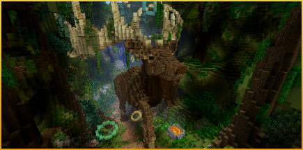{width=200} | Celts | Slalom through Standing Stones and marvel at mighty beasts, as you traverse a track inspired by Europe's mystic past. |
| 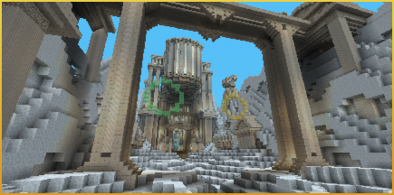{width=200} | Icarus | Swoop down the slopes of Mount Olympus, twist through the labyrinth's many turns and hurtle into Hades. |
| 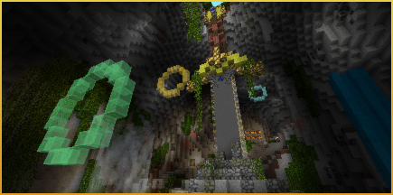{width=200} | Excalibur | Castles and dragons tower over this fantasy Glide track. It'll take flying skills of some (ex)caliber to get you to the end of this Arthurian legend. |
| 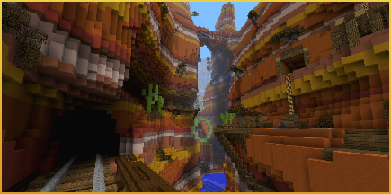{width=200} | Canyon | Soar through the Canyon's windswept strata, winding round stone arches and frontier railways, on this Wild West express to reach ancestral lands. |
| 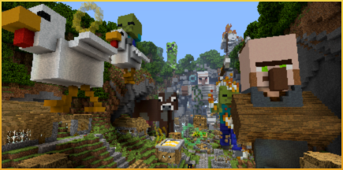{width=200} | Mobs | Swoop over, around and beneath the mighty, monolithic mobs that dominate the skyline of this out-of-scale track. |
| 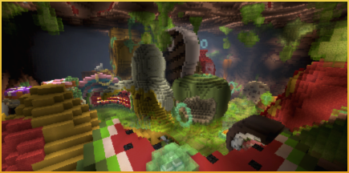{width=200} | Body | A junk food junkyard! A vessel of viruses! A flotilla of phlegm! Grit your teeth for a slimy flight on this unhealthy trip through the human body. |
| 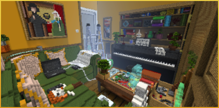{width=200} | Shrunk | Are you tiny or is everything else just really, really big? Be careful not to lose your sense of proportion as you glide your way through this oversized house and tidy up the competition. |
| 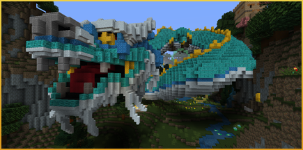{width=200} | Dragon | Share the skies with Dragons, soaring above the epic landscape of this Chinese Mythology-inspired track. |
| 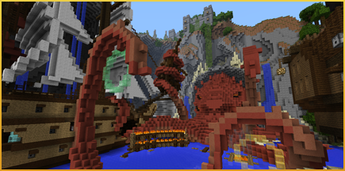{width=200} | Kraken | Plunge past the pirates' wrecks to find forgotten treasures. But beware: the Kraken awaits! |
| 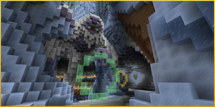{width=200} | Yeti | Swoop down the icy glacier and between the bones of giants to discover the lost land of the Yeti. |
| 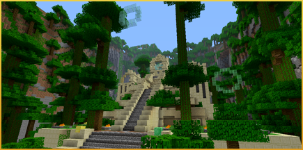{width=200} | Temple | Dive deep into the jungle and discover the secrets of the Temple. |
| 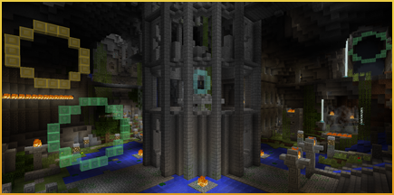{width=200} | Cavern | Fly through the ancient catacombs of the Cavern! |
| 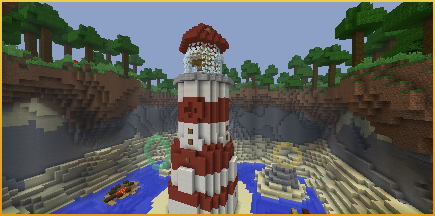{width=200} | Lighthouse | Dive down into the oceans and rivers to discover the caverns that lay beneath the Lighthouse. |